# **TP Final Machine Learning Engineering**


The objective of the following project is to build an ETL capable of processing the [Airlines Delay and Cancellation Data from 2009-2018](https://www.kaggle.com/yuanyuwendymu/airline-delay-and-cancellation-data-2009-2018?select=2009.csv), to detect the anomalies on the average of the daily departure delay for each airport.

The ETL is developed using Apache Airflow which extracts the raw data from S3; process it, applies an ARIMA model, and stores the data on a database created on an RDS instance; where Apache Superset is connected to visualize the results. A scalable infrastructire is deployed to enable the solution:
- implementation of a [*Managed Workflows for Apache Airflow* environment (MWAA)](https://aws.amazon.com/managed-workflows-for-apache-airflow/), where the model will run to detect the airport's departure delya anomalies. To detect an anomaly, an [ARIMA](https://www.statsmodels.org/devel/generated/statsmodels.tsa.arima.model.ARIMA.html) model is used, and the threshold to split a normal observation of an anomaly, is a 80% confidence interval, calculated by the same ARIMA model.
- deployment of a [PostgreSQL RDS instance](https://aws.amazon.com/rds/), where the daily summarized values are going to be stored.
- deployment of [Apache Superset](https://superset.apache.org/), which we will connect to the database created on the RDS instance and generates a dahsboard to visualize:
    - the number of daily flights of each airport, indicating the days considered as an anomaly regarding the departure delay
    - the average departure delay of each airport, together with the expected value and the 80% CI returned by the ARIMA model


## **Airports Data**

As I comented previously, the data refers to the airlines delay and cancellation flights from 2009-2018, and once downloaded, I upload them on `com.lucianonaveiro.itba.tp.airport.data` S3 bucket.

After uploading them, I deploy all the infrastructure


## **AWS Infrastructure**
First I create some S3 buckets, and copy my local files to AWS:
- `airflow-itba-tp.lucianonaveiro`: where the `dags` and `requirements.txt` file are stored
- `com.lucianonaveiro.itba.tp.cloudformation`: where I store some large CloudFormation templates
- `com.lucianonaveiro.itba.tp.airport.plots`: where I store the ouptut files from the ETL process executed by Apache Airflow

To do that, I execute the following CloudFormation template

```
$ aws cloudformation deploy \
  --stack-name TP-ITBA-S3 \
  --template-file cloudformation/01_s3.yaml

```

Once created, I copy my local files to S3

```
$ aws s3 cp --recursive airflow/dags s3://airflow-itba-tp.lucianonaveiro/dags/

$ aws s3 cp airflow/requirements/requirements.txt s3://airflow-itba-tp.lucianonaveiro/requirements.txt

```

Afer this, I execute the template that builds the VPC where all the services and resources created for this project are going to run:

```
$ aws cloudformation deploy \
  --stack-name TP-ITBA-VPC \
  --template-file cloudformation/02_vpc.yaml \
  --capabilities CAPABILITY_IAM
```

Once the VPC is created, I deploy both the MWAA and Apache Superset. For the latter one, I base on the following [Quick Start Reference Deployment](https://aws-quickstart.github.io/quickstart-apache-superset/).

```
$ aws cloudformation deploy \
  --stack-name TP-ITBA-AIRFLOW \
  --template-file cloudformation/03_managed_airflow.yaml \
  --capabilities CAPABILITY_IAM

$ aws cloudformation deploy \
  --stack-name TP-ITBA-SUPERSET \
  --template-file cloudformation/04_superset.yaml \
  --s3-bucket com.lucianonaveiro.itba.tp.cloudformation \
  --s3-prefix superset \
  --capabilities CAPABILITY_IAM
```

Once all tthe stacks finish creating, I deploy the RDS instance. This instance is not available from the public internet: only MWAA, Apache Superset and an EC2 instance I deploy to run the `db/init.sql` script (by using the `UserData` on the CloudFormation template, to create the `airport_daily_summary` table inside the RDS instance), have access to it.

```
$ aws cloudformation deploy \
  --stack-name TP-ITBA-RDS \
  --template-file cloudformation/05_rds.yaml \
  --capabilities CAPABILITY_IAM
```

When all the stacks are created, I look on CloudFormation AWS Console for the Apache Airflow URL, the Apache Superset URL and the RDS endpoint, on the output of each stack 


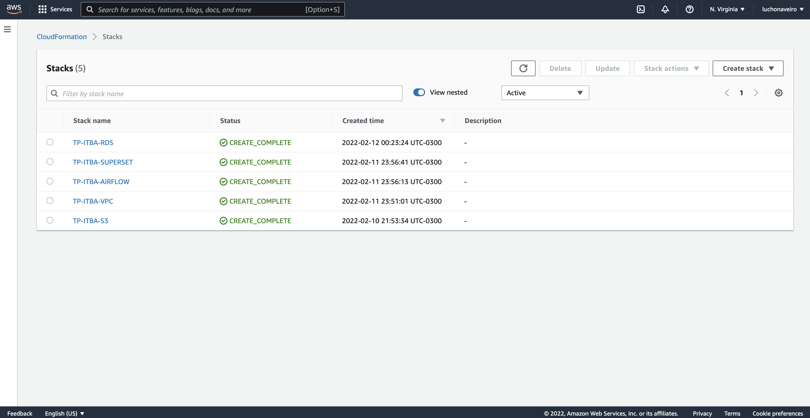

Just to visualize it, this is the whole infrastruture created by the CloudFormation stacks, to develop the ETL:

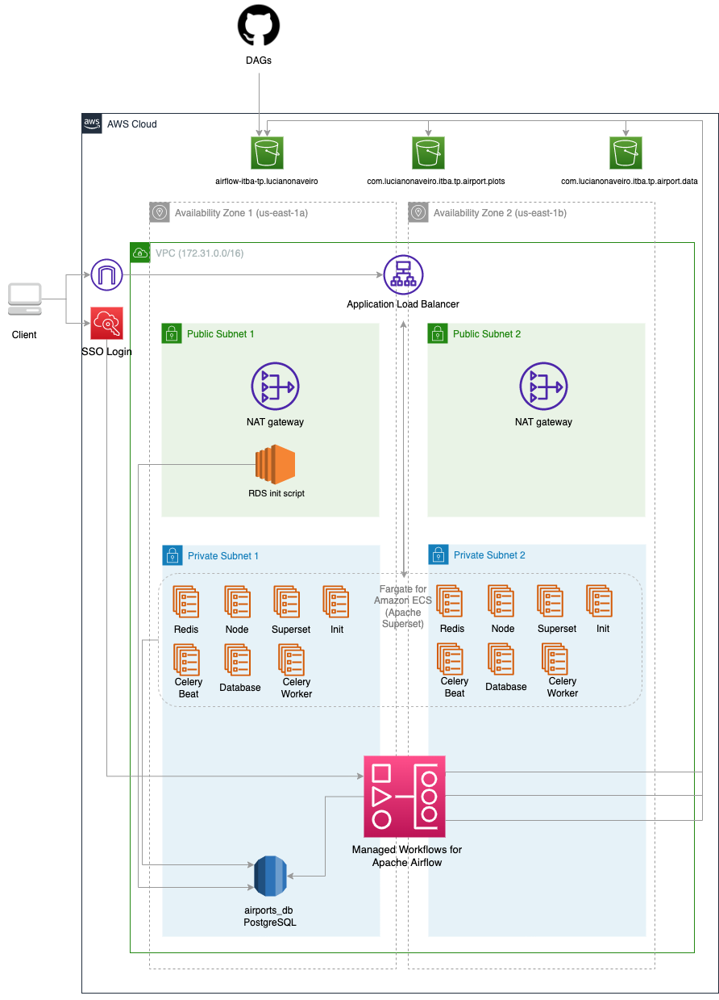


## **Apache Airflow**
The first thing to do when MWAA is running, is to create the connection to the RDS instance, under the name of `airports_db`, the host value we get it from CloudFormation outputs (from `TP-ITBA-RDS` stack), user and password are both postgres, port is 5432.

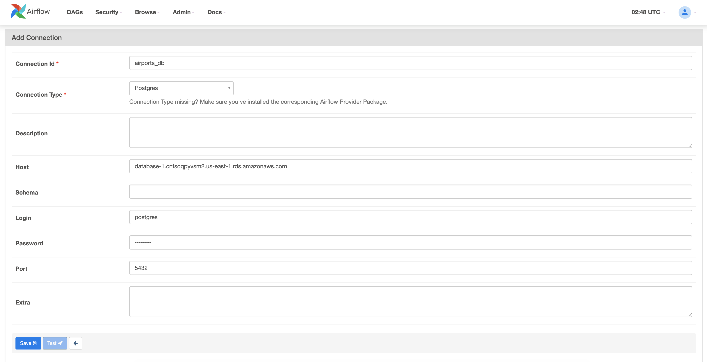

Once created the connection, I can turn on the `airports_daily_summary` DAG, which has an annual schedule with a backfill from 2009 to execute the ETL for all the necessary years.

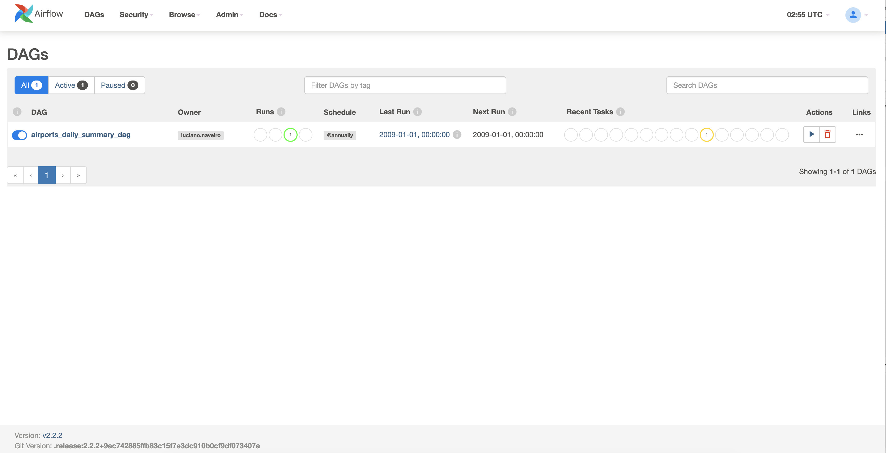

The DAG is in charge of:
- downloading the raw data from `com.lucianonaveiro.itba.tp.airport.data` S3 bucket
- process the data generating a daily timeseries for each airport 
- run the ARIMA model to each timeseries,finding the days where the departure delay is quite different as normal
- store the daily summarized table on the table created on the RDS instance
- generate 2 plots for each airport and store them on `com.lucianonaveiro.itba.tp.airport.plots` S3 bucket. The plots explain the following:
    - number of dialy flights for each airport, indicating the days with anomalies.
    - expected values and 80% CI vs the observed average departure delay, to understand the decision of the model when splitting between normal and days with anomalies.

The DAG executes all these steps for each year from 2009 to 2018.

On the following plots, we can see the data from the *ANC* airport from 2013, where we can see clearly the days with strange average departure delay, are quite off the 80% CI from the ARIMA model.

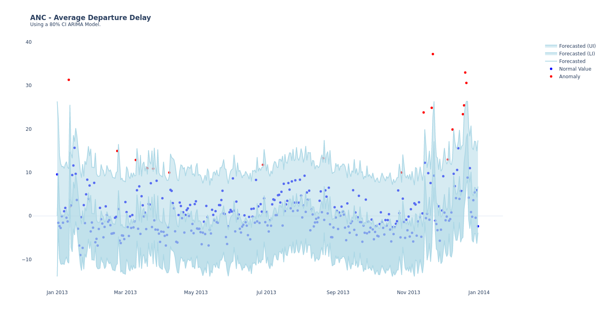
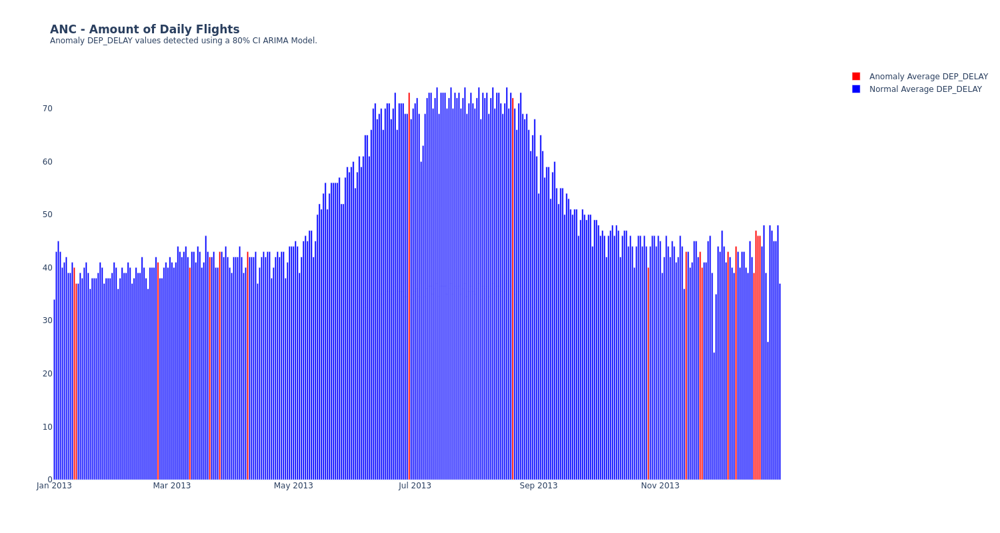

In case of executing twice the same year from Apache Airflow, the data does not duplicate on the table inside the RDS instance, since the combination of date and airport is defined as primary key, and the `IntegrityError` exception is managed, so neither the data is duplicated, nor the code is going to break.


## **ARIMA Model**
As I explained previously, to split between normal and days with anomalies, I fit an ARIMA model to the daily average departure delay for each airport (for each year) and compare the obersved average, with the 80% CI returned by the ARIMA model. 

ARIMA, short for *Auto Regressive Integrated Moving Average* is actually a class of models that explains a given time series based on its own past values, that is, its own lags and the lagged forecast errors, so that equation can be used to forecast future values.

An ARIMA model is characterized by three terms:
- `p` is the order of the *Auto Regressive* (AR) term. It refers to the number of lags of Y to be used as predictors.
- `q` is the order of the *Moving Average* (MA) term. It refers to the number of lagged forecast errors that should go into the ARIMA Model.
- `d` is the number of differencing required to make the time series stationary

An ARIMA model is one where the time series was differenced at least once to make it stationary and you combine the AR and the MA terms. So the equation becomes:

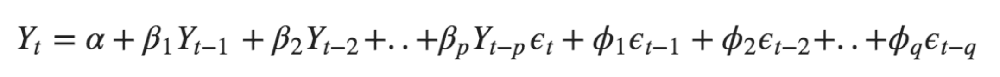

On this project, to select the optimum values of `p`, `q` and `d` for each time series, a Grid Search approach was selected (using 66% of the data as training an the rest as test), where the selected values are the ones that minimizes the error.

As the problem is one of a time series, the order of tha data points matter, so the split between training and test set is ont random, instead we do a nested approach, where I iterate the 33% test data, predicting only one day at a time, so at the end of the process I compare all the single pedictions with the test array to get the final error.

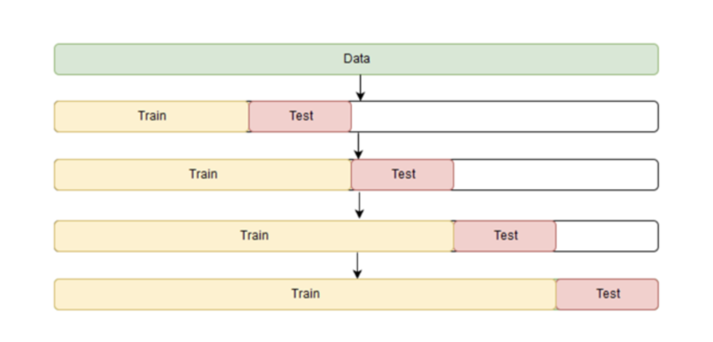


## **Apache Superset**
Once that the DAG ran for all the airports for all the years, storing the summarized data on the PostrgeSQL RDS table, I can start using Apache Superset and connect it to the DB 

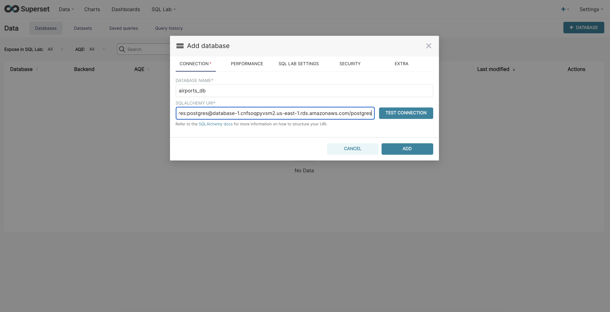

When the connection is created, I can define a dataset pointing to the `airport_daily_summary` table created on the RDS instance. While creating the dataset, i am going to define 2 new dimensions `date` (is the same `date` as the DB, but in timestamp) and `dep_delay_anomaly_label` (is just a map from `dep_delay_anomaly` to visualize it clearly on the dashabord)

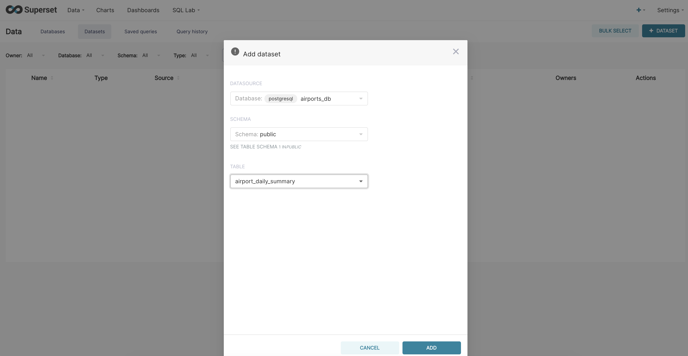
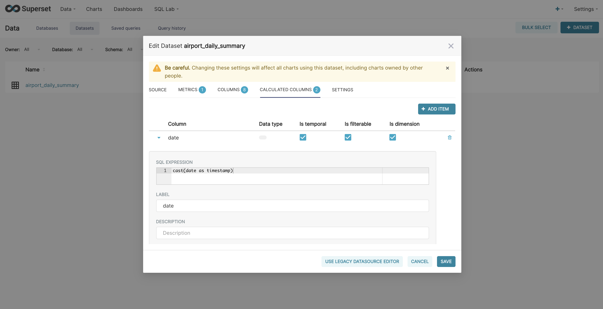
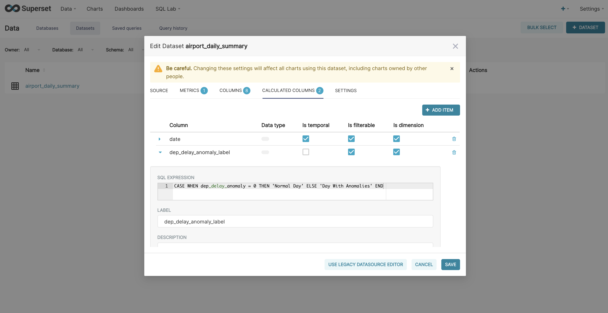

Having Apache Superset connected to the PostgreSQL DB, I can create the dashboards with the same plots as the DAG stored on `com.lucianonaveiro.itba.tp.airport.plots` S3 bucket, along with 2 filters: one for date and the other for the airport.

To accomplish these we have to build 3 charts (`Charts -> + Chart (Button)`). First we will build the `Amount of Flights` plot, where we select the dataset we want to use (`public.airport_daily_summary`) and the visualization type (`Time-series Chart`).

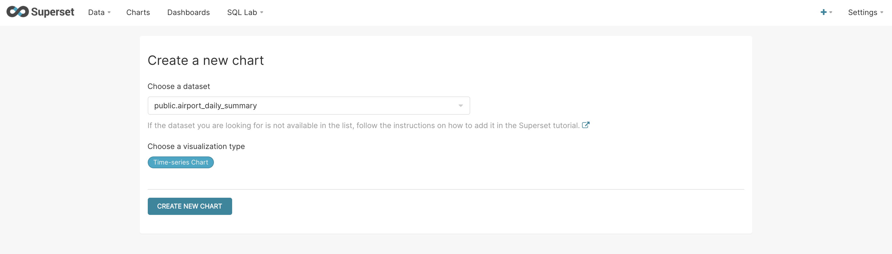

Now, on the `Data` section, we have just to select the date column, the metric we want to plot and how we are going to break it down. Here I chose to break down the amout of daily flights by the flag `dep_delay_anomaly`, which is the flag created with ARIMA model to detect the days with anomalies.

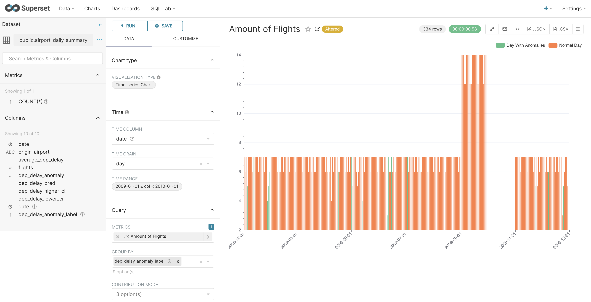

On the `Customize` section, I just enable the legend to be displayed, and stacked the daily values.

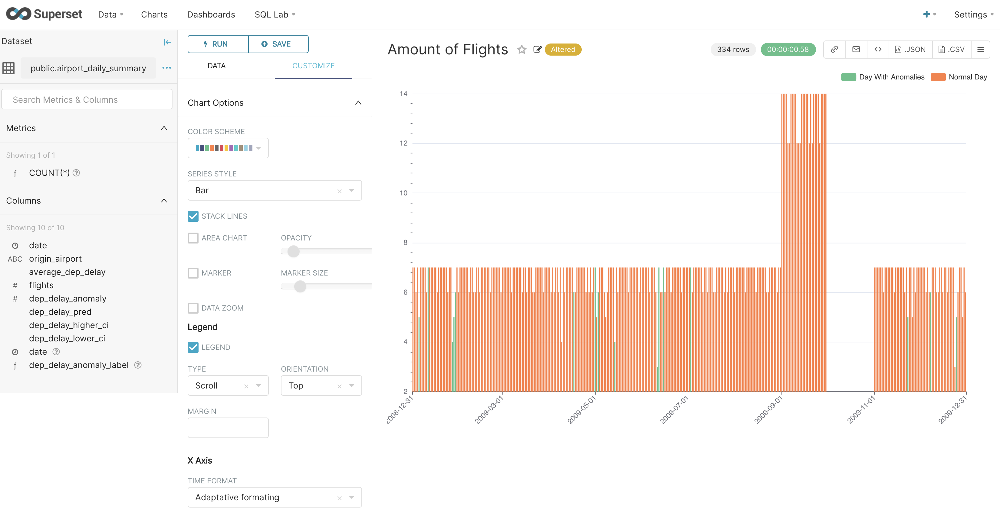

For the second plot, the one displaying the predicted average departure delay vs the observed value, together with the CI, we choose the same dataset and visualization type as the previuos one, but we add more metrics, on per each series we want to plot.

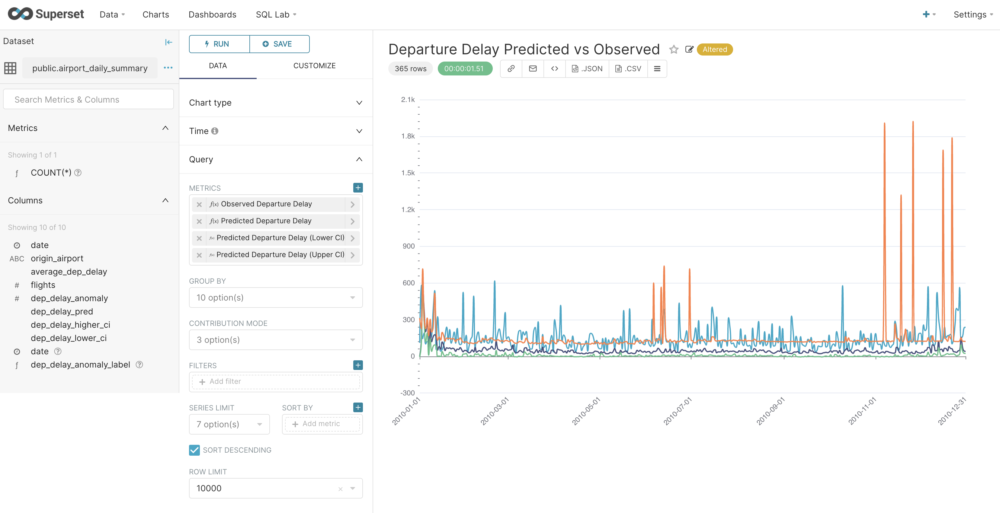

Last, for the filter, we also create a chart with the same dataset as teh previous, but with a `Filter box` as the visualization type. Here we choose the `date` and `origin_airport` columns to be filtered.

When the dashboard is set up, I can filter the year 2013 and the *ANC* airport and find the same insights as on the plots stored on S3.

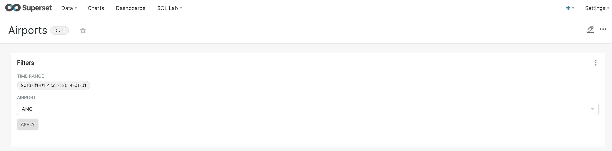
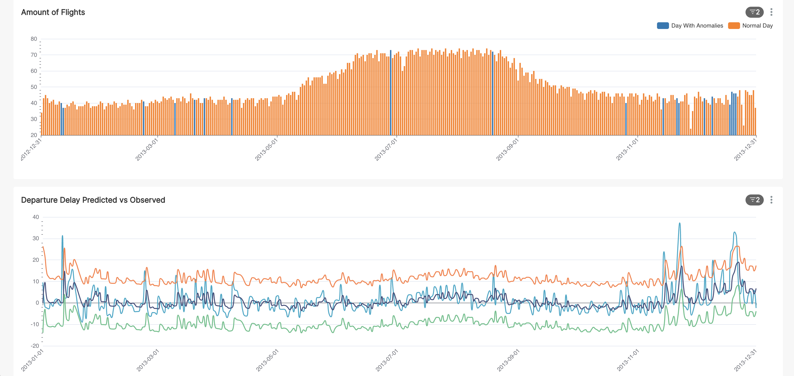

## **CI/CD**
I also implemented a *CI/CD Pipeline* using GitHub Actions (the workflow named `deploy_s3.yml`), which on each push and merge to the main branch, it uploads the `airflow/dags` directory and the `airflow/requirements.txt` file to the `airflow-itba-tp.lucianonaveiro` S3 bucket.

To correctly implement this, I create an IAM User with an attached policy to be able to upload and delete files to the `airflow-itba-tp.lucianonaveiro` S3 bucket:

```
$ aws cloudformation deploy \
  --stack-name TP-ITBA-GHA-IAM \
  --template-file cloudformation/06_gha_iam.yaml \
  --capabilities CAPABILITY_NAMED_IAM
```

On the outputs pane of this stack, both the `ACCESS_KEY_ID` and the `SECRET_ACCESS_KEY` can be found. These two values are necessary to create the *Secrets* on GitHub Actions settings

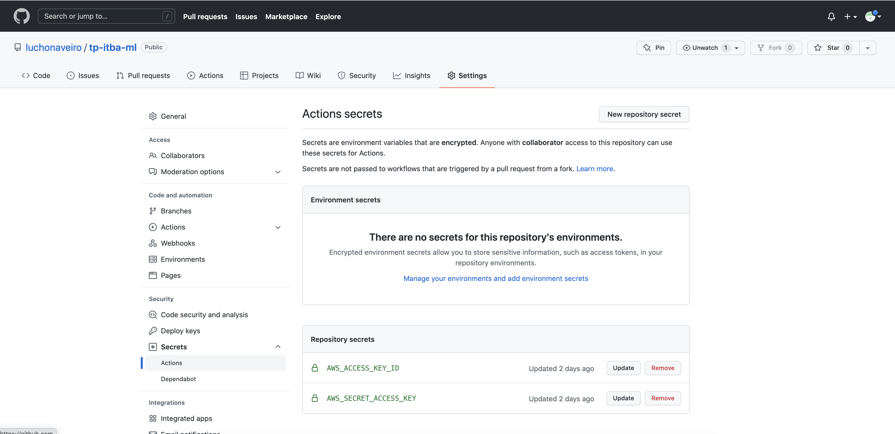

So, once the Github Action is triggered, we can see clearly how th DAGs and `requirements.txt` files are uploaded to S3


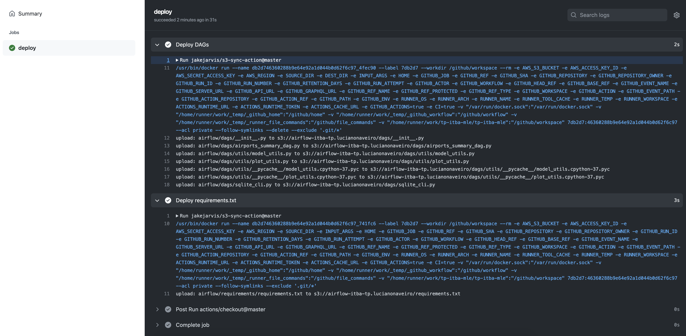

The DAGs deployment has a special treatment, in which I first delete all the files on the bucket, and then upload the files
